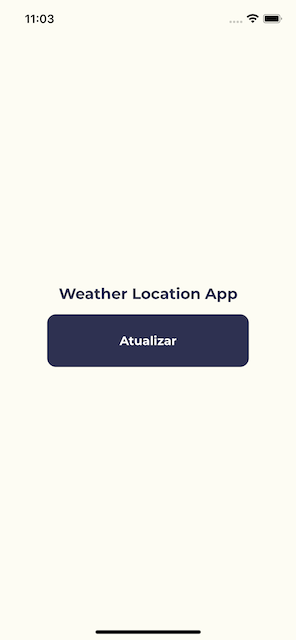
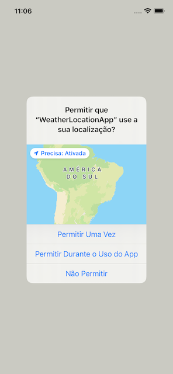
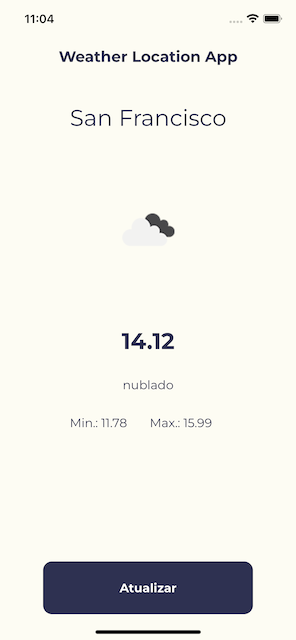

# Weather Location App

React Native App para exibição de dados climáticos a partir da localização do usuário.

# Sumário

1. [Sobre](#sobre)
2. [Instalação](#instalação)
3. [Como rodar a versão Android](#como-rodar-a-versão-android)
4. [Pacotes](#pacotes)
5. [Code Push](#code-push)
6. [Mudando o ambiente do aplicativo](#mudando-o-ambiente-do-aplicativo)
7. [Configuração de ambiente](#configuração-de-ambiente)
8. [Boas práticas](#boas-práticas)

## Sobre

Este projeto foi construído usando o [React Native](https://reactnative.dev/) e [React Native Cli](https://github.com/react-native-community/cli).

Ele roda em dispositivos Android e iOS.

## Instalação

Você deverá clonar o repositório na sua máquina:

```bash
git clone https://github.com/Team-Bdoo/bdoo-delivery-native-app.git
```

Se você quiser salvar suas credenciais do Gitlab, basta rodar o comando abaixo:

```bash
git config --global credential.helper store
```

Após clonar o repositório, você precisará do [Node.js](https://nodejs.org/en/) em sua máquina.

Caso você esteja em um ambiente Linux/MacOS, nós recomendamos fortemente que você use o [nvm](https://github.com/nvm-sh/nvm) para instalar o Node.js:

```bash
# Instala o NVM
curl -o- https://raw.githubusercontent.com/nvm-sh/nvm/v0.39.1/install.sh | bash

# Atualiza o profile do seu terminal
source ~/.bashrc && source ~/.zshrc

# Instala a versão 14 (LTS) do Node
nvm install 14

# Aplica a versão instalada
nvm use 14

# Instala o yarn
npm i -g yarn
```

Com o Node.js rodando, você pode instalar as dependências do projeto:

```bash
yarn install
```

## Como rodar a versão Android

[!] Para fazer o setup no windows.

[Windows SO](https://reactnative.dev/docs/environment-setup)

### Caso você esteja em um ambiente Mac OS:

Após a instalação do Node.js, você precisará de mais uma ferramenta: o [Homebrew](https://brew.sh/).

Com o Homebrew instalado, você poderá instalar algumas dependências necessárias:

```bash
# Para instalar o Watchman
brew install watchman

# Para instalar o JDK
brew install --cask adoptopenjdk/openjdk/adoptopenjdk11
```

Com as dependências instaladas, você irá instalar o [Android Studio](https://developer.android.com/studio).

Atente-se para que, durante a instalação do Android Studio, estas 3 opções estejam habilitadas:

- `Android SDK`;
- `Android SDK Platform`;
- `Android Virtual Device`.

Após instalar o Android Studio, precisaremos fazer algumas configurações extras.

Abra o Android Studio e rode o **SDK Manager**: Em _Configure_, selecione o _SDK Manager_.

Vá a aba _SDK Platforms_ e habilite a opção de _Show Package Details_.

Expanda a opção **Android 10 (Q)** e marque as opções:

- `Android SDK Platform 29`;
- `Intel x86 Atom_64 System Image`.

Após, vá a aba _SDK Tools_ e habilite a opção de _Show Package Details_.

Expanda a opção **Android SDK Build-Tools** e selecione a versão `29.0.2`.

Selecione também a opção `Android SDK Command-line Tools (latest)`.

Clique em **Apply** e aguarde as alterações serem feitas.

Após isso, você deverá configurar o perfil do seu terminal, para que ele reconheça as pastas do Android Studio.

Para isso, edite o `~/.bashrc` (ou `~/.zshrc`) e insira:

```bash
export ANDROID_HOME=$HOME/Library/Android/sdk
export PATH=$PATH:$ANDROID_HOME/emulator
export PATH=$PATH:$ANDROID_HOME/tools
export PATH=$PATH:$ANDROID_HOME/tools/bin
export PATH=$PATH:$ANDROID_HOME/platform-tools
```

Com toda essa configuração feita, você poderá iniciar um dispositivo Android.

Você pode usar um dispositivo físico via USB ou instalá-lo através do emulador.

Caso queira rodar através do emulador, abra o Android Studio, vá em _Configure_ e selecione _AVD Manager_.

Após, clique em _Create Virtual Device_, escolha qualquer dispositivo e então selecione `Q API Level 29 Image`.

Se tudo ocorrer bem, você poderá iniciar o dispositivo clicando no botão de Play no AVD.

**Observação importante**: Caso você tenha algum problema ao rodar o projeto em dispositivos Apple com chipset M1, você pode tentar rodá-lo usando o Rosetta:

1. Abra a pasta de _Applications_;
2. Selecione o aplicativo de Terminal que você usa;
3. Aperte o botão direito e clique em _Duplicate_;
4. Com a versão duplicada, renomeie o app escrevendo (Rosetta) no nome;
5. Clique em _Get Info_ e selecione _Open using Rosetta_.

Agora, é só usar esse Terminal com Rosetta para iniciar a aplicação.

## Pacotes

Os principais pacotes dessa aplicação são:

- [react-native](https://reactnative.dev/docs/0.68/getting-started): 0.68
- [react-native-geolocation-service](https://github.com/Agontuk/react-native-geolocation-service)
- [@reduxjs/toolkit](https://redux-toolkit.js.org/)
- [react-redux](https://react-redux.js.org/)
- [emotion.sh](https://emotion.sh/docs/introduction)
- [jest](https://jestjs.io/)
- [testing-library](https://testing-library.com/)

## Suporte ao Hermes

Habilitar o [hermes](https://reactnative.dev/docs/0.68/hermes) para permitir maior experiência de velocidade no boot inicial do aplicativo e maior gerenciamento de consumo de memória.

## Configuração de ambientes

Fornecer segurança e boas práticas na separação de configs de dados com base no [12 factor](https://12factor.net/config) atráves do módulo [react-native-config](https://github.com/luggit/react-native-config)

## Estrutura de projeto

```
src
├── @tests         # testes dos componentes, serviços e telas
├── @types         # definições dos tipos (*.d.ts)
├── @themes        # definições dos temas da aplicação
├── @api           # redux query
├── @components    # componentes da aplicação
├── @dto           # payload (request,response)
├── @services      # serviços da aplicação
├── @screens       # telas da aplicação e seus hooks
├── @store         # store global da aplicação
```

As definições de implementação a partir da estrutura de projeto podem ser usadas por meio de caminhos absolutos.

```
import createLogger from '@services/log.service';

const log = createLogger('log');
log('some log');
```

## 🌐 Integração com serviço OpenWeathermap

Para obter os dados de clima é utilizada o serviço [OpenWeathermap](https://openweathermap.org/current)

Resumidamente, o serviço retorna dados do clima local com base nos seguintes parâmetros obrigatórios.

- [lat] - (Latitude fornecido através do módulo react-native-geolocation-service)
- [lon] - (Longitude fornecido através do módulo react-native-geolocation-service)
- [appid] - chave da api ativada e configurada nos arquivos arquivos (.env|.env.staging|.evn.production) na entrada API_OPEN_WEATHER_MAP_KEY

## 🌐 Lidando com estados e requisições

O gerenciamento dos estados na aplicação é baseado no [redux-toolkit](https://redux-toolkit.js.org/).

Para lidar com requisições entre api's além de oferecer controle de cache sem a necessidade de escrever estas features, é usado o [RTK Query](https://redux-toolkit.js.org/rtk-query/overview)

### Veja um exemplo:

```tsx
const [weatherResult, {onPressSend}] = useWeatherHook();
```

## Execução dos scripts

As definições dos scripts são orquestadros via [npm scripts](https://docs.npmjs.com/misc/scripts).
Fica a seu critério usar `npm` ou `yarn`.

| Script            | Description                                                       |
| ----------------- | ----------------------------------------------------------------- |
| `clean`           | Executa uma séries de limpeza e instalação.                       |
| `android:dev-stg` | Inicia a exeução do android em **debug** mode.                    |
| `ios:dev-stg`     | Inicia a exeução do ios em **debug** mode.                        |
| `test`            | Execução de todos os arquivos de testes (Jest + testing-library). |

**Caso tenha problemas com permissão ao executar o arquivo clean.sh**

chmod 775 clean.sh

## Telas da aplicação

**_Introdução_**



**_Permissão_**



**_Clima_**


